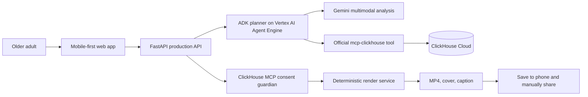

# Architecture

## System overview

## Responsibilities

| Component | Responsibility | Status |
| --- | --- | --- |
| Next.js web app | Mobile controls, browser voice input, ordered media and cover selection, generation, inline preview, Save and native Share | Implemented, hosted, and browser verified; physical-device actions pending ST-52 |
| FastAPI | Validation, consent enforcement, private media upload/analysis, CORS, constrained planning and render endpoints | Implemented, hosted, and exercised by production journeys |
| Gemini planner | Structured title and caption generation from a production request | Implemented and exercised through the hosted journey |
| ADK Agent Engine planner | Typed, exactly 60-second media selection and music direction using one constrained preference tool | Deployed and workflow-smoke verified |
| Media analysis | Consent-gated private GCS upload, schema-validated Gemini descriptions, quality signals, duplicate detection, privacy flags | Implemented and exercised through the hosted journey |
| ClickHouse adapter | Explainable preference recall and required consent/export decision via official `mcp-clickhouse` | Deployed; Agent Engine preference-tool invocation and hosted export path verified |
| Render service | Deterministic 60-second 9:16 MP4, caption, cover, and optional sound mix | Deployed; original-song and no-music browser journeys verified |
| Original memory-song service | Approved-fact music brief, safe Lyria 3 song generation, temporary render-only audio, and instrumental/no-sound fallback | Deployed; original-song browser journey verified, instrumental rerun pending ST-52 |

## Production flow

1. The browser collects a request, deliberately selected media, and explicit permission.
2. The API rejects media analysis without explicit consent, validates image/video MIME and configured upload limits, and stores the original in the private `${resource_name}-media` bucket.
3. Vertex AI Gemini analyzes the private GCS URI and the API returns only schema-validated public metadata; a provider URI or credential is never returned.
4. The API sends only consented media metadata to the bounded ADK planner on Vertex AI Agent Engine. The planner calls the approved ClickHouse preference tool once and returns a typed, exactly 60-second plan. The API rejects unknown media IDs, private URIs, invalid durations and unsafe music directions. It may hold back a redundant or low-quality item but never deletes the original. Any low-confidence place is omitted until confirmed.
5. When the user chooses an original AI song, the API derives its prompt from approved request facts only, rejects artist/song/voice imitation requests, and keeps generated audio only in the render's temporary working directory. The deterministic renderer receives the constrained storyboard and optional temporary audio; the agent never encodes the video itself.
6. Immediately before rendering and export, the Consent Guardian calls the official ClickHouse MCP path to check consent, selected-media status, and soundtrack safety.
7. A passing check permits a 9:16 approximately-one-minute MP4 for manual saving and sharing. A denied or unavailable required check blocks export.

## Data and privacy boundaries

- Original media stays in private storage; the browser never receives database or cloud-service credentials.
- The API derives a content-addressed `media_id`, and model output is rejected if it contains a private `gs://` URI.
- Secrets belong in Google Secret Manager in deployment, not browser variables or the repository.
- ClickHouse stores anonymised production events, preference decisions, and render outcomes—not raw media.
- The system records a held-back media decision instead of deleting a file.
- CORS uses explicit allowed origins through `WEB_ORIGINS`.

## Deployment target

The deployed architecture is a Next.js web client plus FastAPI/render services on Cloud Run, an ADK planner on Vertex AI Agent Engine using Gemini, Google Cloud AI media analysis, ClickHouse Cloud through the official MCP server, and Google Secret Manager for credentials. The app component receives `MEDIA_BUCKET`, `GOOGLE_CLOUD_PROJECT`, `GOOGLE_CLOUD_LOCATION`, and the smoke-tested `MEMORY_FILM_PLANNER_RESOURCE` as non-secret Terraform-managed settings; bootstrap remains outside daily app/platform workflows. Agent Engine uses its own least-privilege no-key service account and private staging bucket. See [Agent Engine operations](operations/AGENT_ENGINE.md) for deployment, evidence, and rollback gates, and the [capability evidence matrix](CAPABILITY_EVIDENCE.md) for current proof boundaries.

## Public edge

`memorydirector.com` is served through a Global External Application Load
Balancer. Cloudflare provides DNS-only apex and `www` records; the load
balancer terminates Google-managed TLS, redirects HTTP to HTTPS and `www` to
the apex, sends browser requests to the web Cloud Run service, and rewrites
same-origin `/api/*` requests before forwarding them to FastAPI through a
serverless NEG. The `public-edge` Terraform component has isolated state and a
separate manually triggered workflow. Cloud Run ingress is tightened only
after a real HTTPS smoke test passes.
