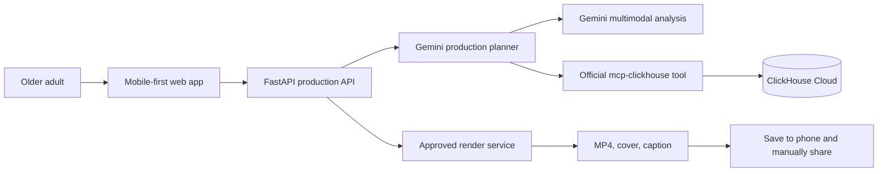

# Architecture

## System overview

## Responsibilities

| Component | Responsibility | Status |
| --- | --- | --- |
| Next.js web app | Mobile controls, browser voice input, media selection, consent, plan review, render request | Implemented locally |
| FastAPI | Validation, consent enforcement, CORS, storyboard and render endpoints | Implemented locally |
| Gemini planner | Structured title and caption generation from a production request | Implemented behind `GEMINI_API_KEY`; live verification pending |
| Media analysis | Multimodal descriptions, quality signals, duplicate detection, privacy flags | Planned |
| ClickHouse adapter | Explainable recall of accepted/rejected creative preferences via `mcp-clickhouse` | Adapter and schema implemented; Cloud verification pending |
| Render service | Deterministic vertical 45–60 second MP4, cover, caption | Planned |

## Production flow

1. The browser collects a request, selected media, and explicit permission.
2. The API rejects planning without a positive media count and explicit consent.
3. Gemini proposes a storyboard. Any low-confidence place requires a confirmation step before final copy.
4. The user reviews and explicitly approves the plan.
5. Only then can the render endpoint accept a render request.
6. The render service produces an MP4, cover, and caption for manual posting.

## Data and privacy boundaries

- Original media stays in private storage; the browser never receives database or cloud-service credentials.
- Secrets belong in Google Secret Manager in deployment, not browser variables or the repository.
- ClickHouse stores anonymised production events, preference decisions, and render outcomes—not raw media.
- The system records a held-back media decision instead of deleting a file.
- CORS uses explicit allowed origins through `WEB_ORIGINS`.

## Deployment target

The intended deployment is a Next.js web client plus FastAPI/render services on Cloud Run, Google Cloud AI for Gemini and media analysis, ClickHouse Cloud through the official MCP server, and Google Secret Manager for credentials. This is the target architecture, not a claim that those managed services are already provisioned.
