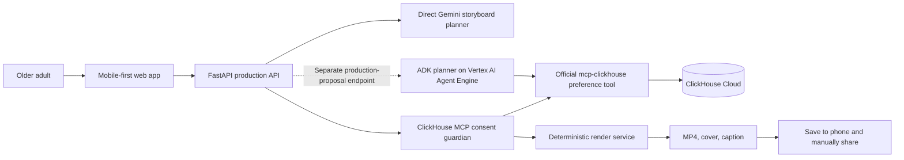

# Architecture

## System overview

## Responsibilities

| Component | Responsibility | Status |
| --- | --- | --- |
| Next.js web app | Mobile controls, browser voice input, ordered media and cover selection, generation, inline preview, Save and native Share | Implemented, hosted, and browser verified; physical-device actions pending ST-52 |
| FastAPI | Validation, consent enforcement, private media upload/analysis, CORS, constrained planning and render endpoints | Implemented, hosted, and exercised by production journeys |
| Direct Gemini storyboard planner | Structured title, caption, and music direction for the public Web `/storyboards` request | Implemented and exercised through hosted browser journeys |
| ADK Agent Engine planner | Separate `/production-proposals` endpoint for typed, exactly 60-second media selection and music direction using one constrained preference tool | Deployed and workflow-smoke verified; not called by the current Web UI |
| Media analysis | Consent-gated private GCS upload, schema-validated Gemini descriptions, quality signals, duplicate detection, and allow-listed privacy metadata | Implemented and exercised through the hosted journey; privacy metadata is not displayed by the current Web UI |
| ClickHouse adapter | Seeded read-only preference demonstration plus required consent/export decision via official `mcp-clickhouse` | Agent Engine preference-tool smoke and hosted export gate verified; no per-user preference-write path in the Web journey |
| Render service | Deterministic 60-second 9:16 MP4, caption, cover, and optional sound mix | Deployed; original-song and no-music browser journeys verified |
| Original memory-song service | Approved-fact music brief, safe Lyria 3 song generation, temporary render-only audio, and instrumental/no-sound fallback | Deployed; original-song browser journey verified, instrumental rerun pending ST-52 |

## Production flow

1. The browser collects a request, deliberately selected media, and explicit permission.
2. The API rejects media analysis without explicit consent, validates image/video MIME and configured upload limits, and stores the original in the private `${resource_name}-media` bucket.
3. Vertex AI Gemini analyzes the private GCS URI and the API returns only schema-validated public metadata; a provider URI or credential is never returned. The current Web UI marks every successfully analyzed item selected and does not display the returned privacy metadata.
4. The Web UI calls `/storyboards`. The API's direct Gemini planner produces the title, caption, and music direction; an optional seeded ClickHouse preference lookup can adjust that direction. The Web request uses the shared `demo-user` default rather than persistent user identity.
5. When the user chooses an original AI song, the API derives its prompt from approved request facts only, rejects artist/song/voice imitation requests, and keeps generated audio only in the render's temporary working directory. The deterministic renderer receives the constrained storyboard and optional temporary audio.
6. Immediately before rendering and export, the Consent Guardian calls the official ClickHouse MCP path to check consent, selected-media status, and soundtrack safety.
7. A passing check permits a 60-second 9:16 MP4 for manual saving and sharing. A denied or unavailable required check blocks export.

## Mobile video thumbnail decision

Selecting a video successfully does not guarantee that a mobile browser can
decode and display a frame from the temporary local `File`/blob URL. In
particular, iOS browsers can return a selected MOV/HEVC asset while withholding
or delaying the decoded frame needed by an HTML `<video>` thumbnail. Desktop
browsers may display the same file because their codec, metadata-loading, and
media-policy behaviour differs. This is a preview limitation, not evidence that
the picker or upload failed.

A native iOS or Android application can ask the operating system media framework
for a thumbnail (for example, PhotoKit/AVFoundation on iOS). It has a more direct
asset and codec path than browser JavaScript. Memory Director is intentionally a
responsive Web application for the current competition, so the project does not
claim this native capability yet.

The Web release uses this bounded fallback:

1. Before selection, the user explicitly confirms that they own or have
   permission to use the selected media. Storage and deletion details remain in
   the privacy documentation rather than the primary creation flow.
2. Every browser first attempts a local blob-backed video frame. Desktop
   browsers remain local-only. A mobile browser sends a thumbnail request only
   when the local frame errors or has not decoded after the bounded wait, with at
   most two requests running concurrently.
3. FastAPI accepts supported phone-video MIME types or a safe filename-extension
   fallback, then runs FFmpeg outside the async event loop. FFmpeg is restricted
   to a known local container format and local-only protocols and produces a JPEG
   within a 480 by 480 bounding box.
4. The JPEG returns to the mobile browser as a temporary object URL and replaces
   the unavailable local frame automatically; there is no separate **Preview**
   button.
5. The content-addressed private source can be reused for Gemini analysis instead
   of uploading the same video again. The source remains in the private media
   bucket and is scheduled for lifecycle deletion after one day.
6. Firestore-backed visitor/IP daily limits, a two-thumbnail worker bound per API
   instance, Cloud Run scaling limits, and the existing budget controls constrain
   public resource use.

The planned formal product is a native mobile application. That version should
generate selection thumbnails locally with the operating system media framework,
retain the same explicit-consent and user-controlled save/share boundaries, and
upload original media only when cloud analysis or rendering actually requires it.

The separate `/production-proposals` endpoint invokes the bounded ADK planner on
Vertex AI Agent Engine. That planner calls the approved ClickHouse preference tool
once and returns a typed, exactly 60-second plan. The API rejects unknown media
IDs, private URIs, invalid durations, and unsafe music directions. Deployment run
34024861486 proves this hosted endpoint and tool boundary, but ST-49's public Web
journey did not call it. Agent Engine never renders the video.

## Data and privacy boundaries

- Original media stays in private storage; the browser never receives database or cloud-service credentials.
- The API derives a content-addressed `media_id`, and model output is rejected if it contains a private `gs://` URI.
- Secrets belong in Google Secret Manager in deployment, not browser variables or the repository.
- ClickHouse stores anonymised consent, selection, export, and seeded preference records—not raw media.
- Removing or reordering a selection never deletes the original file.
- CORS uses explicit allowed origins through `WEB_ORIGINS`.

## Deployment target

The deployed architecture is a Next.js web client plus FastAPI/render services on Cloud Run, an ADK planner on Vertex AI Agent Engine using Gemini, Google Cloud AI media analysis, ClickHouse Cloud through the official MCP server, and Google Secret Manager for credentials. The app component receives `MEDIA_BUCKET`, `GOOGLE_CLOUD_PROJECT`, `GOOGLE_CLOUD_LOCATION`, and the smoke-tested `MEMORY_FILM_PLANNER_RESOURCE` as non-secret Terraform-managed settings; bootstrap remains outside daily app/platform workflows. Agent Engine uses its own least-privilege no-key service account and private staging bucket. See [Agent Engine operations](operations/AGENT_ENGINE.md) for deployment, evidence, and rollback gates, and the [capability evidence matrix](CAPABILITY_EVIDENCE.md) for current proof boundaries.

## Public edge

`memorydirector.com` is served through a Global External Application Load
Balancer. Cloudflare provides DNS-only apex and `www` records; the load
balancer terminates Google-managed TLS, redirects HTTP to HTTPS and `www` to
the apex, sends browser requests to the web Cloud Run service, and rewrites
same-origin `/api/*` requests before forwarding them to FastAPI through a
serverless NEG. The `public-edge` Terraform component has isolated state and a
separate manually triggered workflow. Cloud Run ingress is tightened only
after a real HTTPS smoke test passes.
