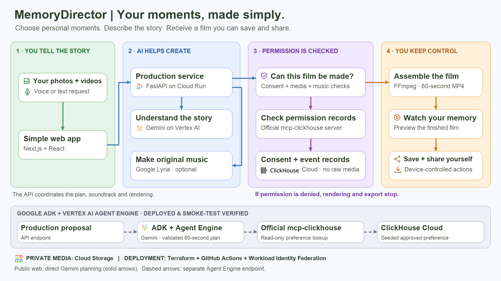

# Architecture

This guide explains how the product implements the experience described in
[About Memory Director](ABOUT.md) and the
[Devpost Project Story](submission/DEVPOST_PROJECT_PAGE.md): older adults choose
their media, describe a memory, and create a film they control. It also documents
deployment automation, the four cost-control layers, and current runtime boundaries.

## System overview

Memory Director helps older adults turn their selected moments and a voice or text
request into a short film. The diagram combines that user journey with the services
that implement it.

[Open the full-size PNG](assets/architecture/memorydirector-architecture.png) ·
[Download the editable draw.io source](assets/architecture/memorydirector-architecture.drawio)

### How to read the diagram

Read the four coloured columns from left to right: **tell the story → create with
AI → check permission → preview, save, and share**. Large labels explain the task;
smaller labels identify the implementation. Solid arrows show the public app's
principal calls and handoffs. The API coordinates the process; the diagram omits
return messages and infrastructure connections for readability. In particular,
Gemini and Lyria return results to the API; Lyria is not downstream of Gemini as a
separate autonomous agent.

The grey strip is labelled **Google ADK + Vertex AI Agent Engine · Deployed &
smoke-test verified** and shows the **separate deployed planning endpoint**. Its
dashed arrows represent that endpoint's ClickHouse preference lookup, verified
through hosted deployment smoke tests. The footer distinguishes this from the
solid-arrow public web path: the current web journey uses `/storyboards` directly.

### 1. You tell the story

The Next.js / React interface accepts deliberately selected photos and videos,
their order, and a typed or browser voice-input request. It does not scan the
user's photo library. Explicit permission is required for media processing.
The selected files and request give the API the material and creative direction
for the film. Voice availability depends on browser support; typing remains an
alternative.

### 2. AI helps create

FastAPI on Cloud Run validates input and coordinates media analysis, planning,
optional music generation, and rendering. Gemini on Vertex AI analyses consented
media and supplies the public app's storyboard metadata, including a title,
caption, and music direction. Structured responses are validated before use.

The user chooses original music, instrumental music, or no sound. The original
music path uses Google Lyria with a brief derived from approved request facts.
Generated audio is temporary input to the renderer. AI planning and music
creation do not grant permission to render or export a film.

### 3. Permission is checked

For the public selected-media flow, the API first checks that each requested media
ID exists and is selected. The Consent Guardian calls `run_query` through the
official `mcp-clickhouse` server and checks that ClickHouse contains
`media_selected` evidence for every requested ID. It also validates the soundtrack
mode. The broader API/music pipeline applies the soundtrack safety constraints;
the database query itself is not an AI judgement about music or media rights.

The required check runs **before rendering and again before export**. Missing
selection evidence, an unavailable MCP query, or missing guardian configuration
blocks the operation. Required event-recording failures also prevent successful
completion. ClickHouse holds workflow records and seeded preferences, not source
photos, video, or audio. This verifies recorded consent evidence; it does not
independently establish legal ownership of uploaded material.

### 4. You keep control

FFmpeg assembles the selected source media and optional soundtrack into a
validated 60-second portrait MP4. The API returns a bundle containing the film,
cover, and caption. The web app exposes preview, saving, and native sharing where
supported. Sharing is initiated by the user through their device; the backend does
not publish to a social network. Neither Gemini nor Agent Engine renders the MP4.

### Separate deployed agent path

`/production-proposals` can invoke a Google ADK planner hosted on Vertex AI Agent
Engine. The agent calls a constrained, read-only ClickHouse preference tool and
returns a typed plan with a total duration of exactly 60 seconds. Validation
rejects unknown media IDs, private provider URIs, invalid durations, and unsafe
music directions before adapting the plan into a production proposal.

The preference lookup uses approved seeded demonstration data. The public web
journey has no durable per-user preference-write path. Its optional storyboard
preference lookup can fall back to the base storyboard when unavailable; this is
different from the required consent check, which blocks rendering/export on
failure.

[Deployment run 34024861486](https://github.com/afaryy/MemoryDirector/actions/runs/34024861486)
verified the hosted Agent Engine path and preference-tool invocation. It is not
evidence that the web UI called that endpoint. See
[Agent Engine operations](operations/AGENT_ENGINE.md) and the
[capability evidence matrix](CAPABILITY_EVIDENCE.md) for the detailed proof boundary.

### Supporting services and trust boundaries

Private Cloud Storage contains consented source media; the browser receives public
metadata and media IDs rather than provider storage URIs or service credentials.
Firestore supports usage limits. Secret Manager holds deployment credentials,
including the MCP credential resolved within the agent runtime. IAM and Workload
Identity Federation support service access and CI deployment without embedding
credentials in the diagram, browser bundle, or repository.

Terraform and GitHub Actions provision and deploy the services. The public edge,
mobile thumbnail fallback, and privacy boundaries are described below; they are
not expanded into individual boxes in the overview.

## Responsibilities

| Component | Responsibility | Status |
| --- | --- | --- |
| Next.js web app | Mobile controls, browser voice input, ordered media and cover selection, generation, inline preview, Save and native Share | Implemented, hosted, browser verified, and physically exercised on an iPhone 11 in ST-52 |
| FastAPI | Validation, consent enforcement, private media upload/analysis, CORS, constrained planning and render endpoints | Implemented, hosted, and exercised by production journeys |
| Direct Gemini storyboard planner | Structured title, caption, and music direction for the public Web `/storyboards` request | Implemented and exercised through hosted browser journeys |
| ADK Agent Engine planner | Separate `/production-proposals` endpoint for typed, exactly 60-second media selection and music direction using one constrained preference tool | Deployed and workflow-smoke verified; not called by the current Web UI |
| Media analysis | Consent-gated private GCS upload, schema-validated Gemini descriptions, quality signals, duplicate detection, and allow-listed privacy metadata | Implemented and exercised through the hosted journey; privacy metadata is not displayed by the current Web UI |
| ClickHouse adapter | Seeded read-only preference demonstration plus required consent/export decision via official `mcp-clickhouse` | Agent Engine preference-tool smoke and hosted export gate verified; no per-user preference-write path in the Web journey |
| Render service | Deterministic 60-second 9:16 MP4, caption, cover, and optional sound mix | Deployed; original-song and no-music browser journeys verified |
| Original memory-song service | Approved-fact music brief, safe Lyria 3 song generation, temporary render-only audio, and instrumental/no-sound fallback | Deployed; original-song and no-music browser journeys verified, and instrumental audio verified on an iPhone 11 in ST-52 |

## Production flow

1. The browser collects a request, deliberately selected media, and explicit permission.
2. The API rejects media analysis without explicit consent, validates image/video MIME and configured upload limits, and stores the original in the private `${resource_name}-media` bucket.
3. Vertex AI Gemini analyzes the private GCS URI and the API returns only schema-validated public metadata; a provider URI or credential is never returned. The current Web UI marks every successfully analyzed item selected and does not display the returned privacy metadata.
4. The Web UI calls `/storyboards`. The API's direct Gemini planner produces the title, caption, and music direction; an optional seeded ClickHouse preference lookup can adjust that direction. The Web request uses the shared `demo-user` default rather than persistent user identity.
5. When the user chooses an original AI song, the API derives its prompt from approved request facts only, rejects artist/song/voice imitation requests, and keeps generated audio only in the render's temporary working directory. The deterministic renderer receives the constrained storyboard and optional temporary audio.
6. Immediately before rendering and export, the Consent Guardian calls the official ClickHouse MCP path to check consent, selected-media status, and soundtrack safety.
7. A passing check permits a 60-second 9:16 MP4 for manual saving and sharing. A denied or unavailable required check blocks export.

## Mobile video thumbnail decision

Selecting a video successfully does not guarantee that a mobile browser can
decode and display a frame from the temporary local `File`/blob URL. In
particular, iOS browsers can return a selected MOV/HEVC asset while withholding
or delaying the decoded frame needed by an HTML `<video>` thumbnail. Desktop
browsers may display the same file because their codec, metadata-loading, and
media-policy behaviour differs. This is a preview limitation, not evidence that
the picker or upload failed.

A native iOS or Android application can ask the operating system media framework
for a thumbnail (for example, PhotoKit/AVFoundation on iOS). It has a more direct
asset and codec path than browser JavaScript. Memory Director is intentionally a
responsive Web application for the current competition, so the project does not
claim this native capability yet.

The Web release uses this bounded fallback:

1. Before selection, the user explicitly confirms that they own or have
   permission to use the selected media. Storage and deletion details remain in
   the privacy documentation rather than the primary creation flow.
2. Every browser first attempts a local blob-backed video frame. Desktop
   browsers remain local-only. A mobile browser sends a thumbnail request only
   when the local frame errors or has not decoded after the bounded wait, with at
   most two requests running concurrently.
3. FastAPI accepts supported phone-video MIME types or a safe filename-extension
   fallback, then runs FFmpeg outside the async event loop. FFmpeg is restricted
   to a known local container format and local-only protocols and produces a JPEG
   within a 480 by 480 bounding box.
4. The JPEG returns to the mobile browser as a temporary object URL and replaces
   the unavailable local frame automatically; there is no separate **Preview**
   button.
5. The content-addressed private source can be reused for Gemini analysis instead
   of uploading the same video again. The source remains in the private media
   bucket and is scheduled for lifecycle deletion after one day.
6. Firestore-backed visitor/IP daily limits, a two-thumbnail worker bound per API
   instance, Cloud Run scaling limits, and the existing budget controls constrain
   public resource use.

The planned formal product is a native mobile application. That version should
generate selection thumbnails locally with the operating system media framework,
retain the same explicit-consent and user-controlled save/share boundaries, and
upload original media only when cloud analysis or rendering actually requires it.

## Data and privacy boundaries

- Original media stays in private storage; the browser never receives database or cloud-service credentials.
- The API derives a content-addressed `media_id`, and model output is rejected if it contains a private `gs://` URI.
- Secrets belong in Google Secret Manager in deployment, not browser variables or the repository.
- ClickHouse stores anonymised consent, selection, export, and seeded preference records—not raw media.
- Removing or reordering a selection never deletes the original file.
- CORS uses explicit allowed origins through `WEB_ORIGINS`.

## Four-layer cost control

The public demo accepts guest requests, so cost controls act at several points in
the workflow. They bound usage before AI calls and rendering, limit bursts and
compute expansion, provide billing safeguards, and reduce retained storage.

| Layer | Mechanism | Role in the workflow |
| --- | --- | --- |
| 1. Application admission | Firestore transactional daily quotas and concurrency leases; tighter original-song quotas; bounded per-stage use | Reserve admission before costly work. Reject exhausted or replayed requests before provider calls. Failed downstream work does not refund the consumed attempt. |
| 2. Edge and compute | Cloud Armor per-IP throttling; Cloud Run instance, concurrency, and timeout limits | Limit bursts and resource expansion. API and web minimum instances are zero. |
| 3. Billing safeguards | Project alert budget and configured eligible-service spend caps | Provide notification and delayed service-level enforcement; do not replace immediate admission checks. |
| 4. Private-media retention | Prefix-scoped Cloud Storage lifecycle rules | Make uploads eligible for deletion after one day and exports after three days; Terraform state has separate storage and retention. |

The reviewed sandbox configuration permits five film attempts per visitor, ten
per IP, and thirty globally per UTC day, with at most six global active film
leases. Original songs have tighter limits of three per visitor and twenty
globally per UTC day. These are configured operating limits, not throughput or
cost guarantees. See [sandbox configuration](../infra/terraform/projects/config/sandbox.json).

The [cost-control operations guide](operations/USAGE_COST_CONTROLS.md) records the
billing controls as configured on 7 September 2026. Alerts do not stop spending,
and spend-cap enforcement and billing reports can lag; in-flight work and
persistent resources may continue to incur charges. ClickHouse Cloud charges are
separate from the Google Cloud budget. Lifecycle deletion is asynchronous rather
than a promise of deletion at an exact hour.

Quota state is authoritative in Firestore, not ClickHouse. ClickHouse's role in
this design remains consent evidence, bounded workflow telemetry, and the seeded
preference lookup. Cost controls complement the consent gate; passing one does
not bypass the other.

## Deployment target

The deployed architecture is a Next.js web client plus FastAPI/render services on Cloud Run, an ADK planner on Vertex AI Agent Engine using Gemini, Google Cloud AI media analysis, ClickHouse Cloud through the official MCP server, and Google Secret Manager for credentials. The app component receives `MEDIA_BUCKET`, `GOOGLE_CLOUD_PROJECT`, `GOOGLE_CLOUD_LOCATION`, and the smoke-tested `MEMORY_FILM_PLANNER_RESOURCE` as non-secret Terraform-managed settings; bootstrap remains outside daily app/platform workflows. Agent Engine uses its own least-privilege no-key service account and private staging bucket. See [Agent Engine operations](operations/AGENT_ENGINE.md) for deployment, evidence, and rollback gates, and the [capability evidence matrix](CAPABILITY_EVIDENCE.md) for current proof boundaries.

## Deployment automation

We built automated deployment workflows with GitHub Actions and Terraform for Google Cloud infrastructure, containerized services, public-domain configuration, ClickHouse schema and access setup, and ADK Agent Engine deployment with runtime verification.

| Workflow | Automated work | Trigger |
| --- | --- | --- |
| [Tests](../.github/workflows/tests.yaml) | API, web, consent-writer, and ClickHouse bootstrap tests; web build | Push and pull request |
| [Terraform](../.github/workflows/terraform.yml) | Configuration-schema checks, TFLint, Trivy, Terraform formatting/validation/tests; selected platform or app plan/apply/destroy | PR checks; manually dispatched infrastructure operations |
| [Deploy application](../.github/workflows/deploy.yml) | Build API/web images, publish to Artifact Registry, deploy Cloud Run through Terraform, preserve existing ingress and Agent Engine settings | Manual, or successful main-branch Tests when auto-deploy is enabled |
| [Deploy consent event writer](../.github/workflows/deploy-consent-writer.yml) | Build/publish the private writer image; deploy its Cloud Run service and access configuration through Terraform | Manual with confirmation input |
| [ClickHouse](../.github/workflows/clickhouse.yml) | Bootstrap database/schema, seed demo preferences, configure SELECT-only MCP and INSERT-only event-writer identities, generate credentials into Secret Manager; separate verify/MCP smoke modes | Manual with confirmation input |
| [Deploy Agent Engine](../.github/workflows/deploy-agent-engine.yml) | Provision agent identity/staging via Terraform; deploy ADK through Python; verify the plan and preference-tool call; switch API only after smoke succeeds | Manual deploy, activate-existing, or agent-resource rollback |
| [Public domain control](../.github/workflows/public-domain-control.yml) | Provision public-edge resources and Cloudflare DNS; verify HTTPS before restricting Cloud Run ingress; explicit destroy mode | Manual |

### Deployment boundaries and operating mode

Terraform provisions Google Cloud infrastructure and the public-edge DNS records.
The Agent Engine runtime is deployed by a Python script within GitHub Actions.
ClickHouse database/schema and identity setup is performed by Python/SQL against
an **existing ClickHouse Cloud service**; these workflows do not create the
ClickHouse Cloud service itself.

The initial Terraform state bucket and GitHub WIF/deployer identity are established
through the separate [administrator bootstrap](operations/TERRAFORM_BOOTSTRAP.md).
Subsequent workflows authenticate through WIF, use protected-environment settings,
and resolve runtime credentials through Secret Manager. The ClickHouse workflow
writes credential versions without putting password/token values into Terraform
state.

Automatic execution after a manual launch is distinct from automatic triggering
on every code change. On 8 September 2026, `sandbox` had
`AUTO_DEPLOY_ENABLED=false`. The application workflow therefore required a manual
launch to deploy; a successful test-triggered workflow could contain a **skipped**
deployment job. Check the deployment job and apply steps when recording release
evidence, rather than relying only on the overall workflow status. This is a dated
configuration observation, not a permanent limitation of the workflow.

Agent Engine smoke verification checks a structured 60-second plan and the
approved ClickHouse preference-tool invocation before API activation. The
public-domain lockdown operation checks the web page and `/api/health` over HTTPS
before restricting ingress. Ordinary application deployment does not itself run
that full end-to-end media journey; retain the separate product acceptance evidence.

## Public edge

`memorydirector.com` is served through a Global External Application Load
Balancer. Cloudflare provides DNS-only apex and `www` records; the load
balancer terminates Google-managed TLS, redirects HTTP to HTTPS and `www` to
the apex, sends browser requests to the web Cloud Run service, and rewrites
same-origin `/api/*` requests before forwarding them to FastAPI through a
serverless NEG. The `public-edge` Terraform component has isolated state and a
separate manually triggered workflow. Cloud Run ingress is tightened only
after a real HTTPS smoke test passes.

## Maintaining the diagram

Edit [the draw.io source](assets/architecture/memorydirector-architecture.drawio)
and export its PNG to the same directory. Keep both files in the same change so
README and this guide show the reviewed version. Preserve the explicit connector
attachment points and bends when editing: they separate the Gemini path, music
branch, and consent handoff without crossing arrows. Update the grey-strip status
only when a web integration is implemented and verified.

Cloud Run, Vertex AI, and Cloud Storage marks come from the
[Google Cloud official icon library](https://cloud.google.com/icons). The
ClickHouse logo comes from the [official ClickHouse repository](https://github.com/ClickHouse/ClickHouse).
The photo, microphone, shield, play, download, and share symbols are generic task
illustrations. Product marks identify the services used by Memory Director.
