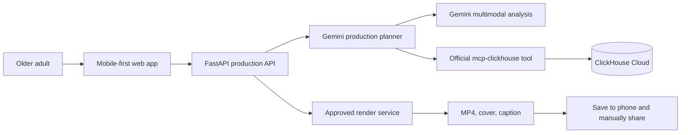

# Architecture

## System overview

## Responsibilities

| Component | Responsibility | Status |
| --- | --- | --- |
| Next.js web app | Mobile controls, browser voice input, media selection, consent, plan review, render request | Implemented locally |
| FastAPI | Validation, consent enforcement, private media upload/analysis, CORS, storyboard and render endpoints | Implemented locally |
| Gemini planner | Structured title and caption generation from a production request | Implemented behind `GEMINI_API_KEY`; live verification pending |
| Media analysis | Consent-gated private GCS upload, schema-validated Gemini descriptions, quality signals, duplicate detection, privacy flags | Implemented locally; hosted verification pending |
| ClickHouse adapter | Explainable recall of accepted/rejected creative preferences via `mcp-clickhouse` | Adapter and schema implemented; Cloud verification pending |
| Render service | Deterministic vertical 45–60 second MP4, cover, caption | Planned |

## Production flow

1. The browser collects a request, selected media, and explicit permission.
2. The API rejects media analysis without explicit consent, validates image/video MIME and the 50 MiB limit, and stores the original in the private `${resource_name}-media` bucket.
3. Vertex AI Gemini analyzes the private GCS URI and the API returns only schema-validated public metadata; a provider URI or credential is never returned.
4. The user selects or holds the asset. Both decisions preserve the original; a held asset is excluded from later curation.
5. Gemini proposes a storyboard. Any low-confidence place requires a confirmation step before final copy.
6. The user reviews and explicitly approves the plan.
7. Only then can the render endpoint accept a render request and produce an MP4, cover, and caption for manual posting.

## Data and privacy boundaries

- Original media stays in private storage; the browser never receives database or cloud-service credentials.
- The API derives a content-addressed `media_id`, and model output is rejected if it contains a private `gs://` URI.
- Secrets belong in Google Secret Manager in deployment, not browser variables or the repository.
- ClickHouse stores anonymised production events, preference decisions, and render outcomes—not raw media.
- The system records a held-back media decision instead of deleting a file.
- CORS uses explicit allowed origins through `WEB_ORIGINS`.

## Deployment target

The intended deployment is a Next.js web client plus FastAPI/render services on Cloud Run, Google Cloud AI for Gemini and media analysis, ClickHouse Cloud through the official MCP server, and Google Secret Manager for credentials. The app component receives `MEDIA_BUCKET`, `GOOGLE_CLOUD_PROJECT`, and `GOOGLE_CLOUD_LOCATION` as non-secret Terraform-managed settings; bootstrap remains outside daily app/platform workflows.

## Public edge

`memorydirector.com` is served through a Global External Application Load
Balancer. Cloudflare provides DNS-only apex and `www` records; the load
balancer terminates Google-managed TLS, redirects HTTP to HTTPS and `www` to
the apex, sends browser requests to the web Cloud Run service, and rewrites
same-origin `/api/*` requests before forwarding them to FastAPI through a
serverless NEG. The `public-edge` Terraform component has isolated state and a
separate manually triggered workflow. Cloud Run ingress is tightened only
after a real HTTPS smoke test passes.
