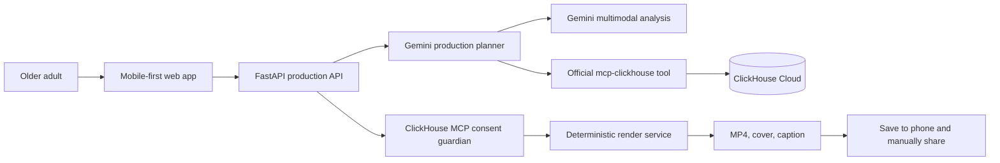

# Architecture

## System overview

## Responsibilities

| Component | Responsibility | Status |
| --- | --- | --- |
| Next.js web app | Mobile controls, browser voice input, selected-media removal, generation request, preview, save/share | Earlier flow implemented locally; simplified UI pending |
| FastAPI | Validation, consent enforcement, private media upload/analysis, CORS, constrained storyboard and render endpoints | Implemented locally; consent/export gate wiring pending |
| Gemini planner | Structured title and caption generation from a production request | Implemented behind `GEMINI_API_KEY`; live verification pending |
| Media analysis | Consent-gated private GCS upload, schema-validated Gemini descriptions, quality signals, duplicate detection, privacy flags | Implemented locally; hosted verification pending |
| ClickHouse adapter | Explainable preference recall and required consent/export decision via official `mcp-clickhouse` | Adapter and schema implemented; hosted runtime gate verification pending |
| Render service | Deterministic approximately-one-minute 9:16 MP4, caption, and optional sound mix | Planned; automatic preview/export verification pending |
| Original memory-song service | Approved-fact lyric/music brief and safe Lyria song generation with fallback | Planned in ST-38 |

## Production flow

1. The browser collects a request, deliberately selected media, and explicit permission.
2. The API rejects media analysis without explicit consent, validates image/video MIME and the 50 MiB limit, and stores the original in the private `${resource_name}-media` bucket.
3. Vertex AI Gemini analyzes the private GCS URI and the API returns only schema-validated public metadata; a provider URI or credential is never returned.
4. The production crew builds a constrained storyboard from the selected media. It may hold back a redundant or low-quality item but never deletes the original. Any low-confidence place is omitted until confirmed.
5. The deterministic renderer receives only the constrained storyboard; the agent never encodes the video itself.
6. Immediately before rendering and export, the Consent Guardian calls the official ClickHouse MCP path to check consent, selected-media status, and soundtrack safety.
7. A passing check permits a 9:16 approximately-one-minute MP4 for manual saving and sharing. A denied or unavailable required check blocks export.

## Data and privacy boundaries

- Original media stays in private storage; the browser never receives database or cloud-service credentials.
- The API derives a content-addressed `media_id`, and model output is rejected if it contains a private `gs://` URI.
- Secrets belong in Google Secret Manager in deployment, not browser variables or the repository.
- ClickHouse stores anonymised production events, preference decisions, and render outcomes—not raw media.
- The system records a held-back media decision instead of deleting a file.
- CORS uses explicit allowed origins through `WEB_ORIGINS`.

## Deployment target

The intended deployment is a Next.js web client plus FastAPI/render services on Cloud Run, Google Cloud AI for Gemini and media analysis, ClickHouse Cloud through the official MCP server, and Google Secret Manager for credentials. The app component receives `MEDIA_BUCKET`, `GOOGLE_CLOUD_PROJECT`, and `GOOGLE_CLOUD_LOCATION` as non-secret Terraform-managed settings; bootstrap remains outside daily app/platform workflows.

## Public edge

`memorydirector.com` is served through a Global External Application Load
Balancer. Cloudflare provides DNS-only apex and `www` records; the load
balancer terminates Google-managed TLS, redirects HTTP to HTTPS and `www` to
the apex, sends browser requests to the web Cloud Run service, and rewrites
same-origin `/api/*` requests before forwarding them to FastAPI through a
serverless NEG. The `public-edge` Terraform component has isolated state and a
separate manually triggered workflow. Cloud Run ingress is tightened only
after a real HTTPS smoke test passes.
