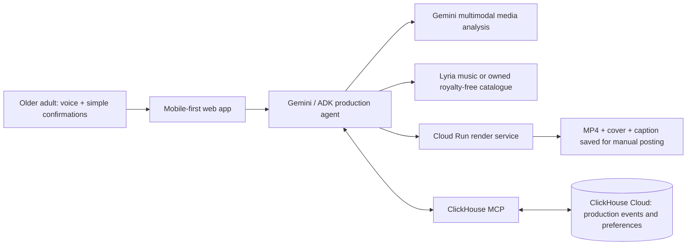

# Memory Director — hackathon design proposal

## Decision

Build **Memory Director**, a voice-led “micro-documentary producer” for older adults. It turns a mixed phone album into a 45–60 second travel or family memory video, plus a cover, title, and caption that the user can save and post manually.

Choose the **ClickHouse track**. The product’s differentiator is not merely one-off AI editing: it builds an explicit, explainable family editing memory from media-selection decisions, music preferences, revisions, accessibility settings, and render outcomes. ClickHouse is used at runtime through the official `mcp-clickhouse` server to query this production history and improve each recommendation.

## Problem and audience

Older adults often capture meaningful trips and family occasions, yet common editors expose a dense timeline, several unfamiliar concepts, and too many simultaneous decisions. They frequently need a family member to select media, remember a foreign location, choose suitably auspicious or warm music, write a caption, and remove awkward clips.

The primary user is an older adult making a family/travel short. A supporting user is an adult child who can help confirm uncertain facts. The project does not publish on the user's behalf: that would introduce unnecessary social-platform permissions and remove user control.

## MVP user journey

1. The user uploads or selects a small album and speaks: “Make last week’s travel memories into a cheerful Moments video.”
2. Gemini extracts the occasion, mood, duration, and ambiguities. It asks only one simple question at a time.
3. Gemini analyses images/video and proposes a shortlist, explaining held-back duplicates or blurry media.
4. When a location is uncertain, the system presents a candidate and asks for confirmation. No uncertain fact is placed in final copy.
5. The user chooses one of three music directions—e.g. “festive but not noisy.” Music is generated with Google’s Lyria resource or drawn from a project-owned, royalty-free catalogue.
6. Gemini produces a 45–60 second storyboard, title, caption, large high-contrast subtitles, and a privacy checklist.
7. After one explicit approval, the renderer creates MP4 + cover + caption. The user saves them to the phone and posts manually.
8. The system logs production events. On the next project, the agent queries ClickHouse MCP for stated preferences, prior accepted/rejected suggestions, and successful formats; it explains the resulting recommendation.

## Architecture

### Components

- **Mobile-first web interface:** One large primary action, voice input, transcript preview, numbered media cards, and one decision per screen.
- **Production agent:** Gemini plus Google ADK on Agent Engine. Orchestrates intent, asset curation, location confirmation, music direction, storyboard, and export approval.
- **Media pipeline:** Gemini multimodal analysis generates visual tags, quality signals, and short descriptions. Store original media privately; never train on it.
- **Renderer:** Cloud Run service builds an MP4 only after an approved edit decision. For a hackathon MVP, accept already-uploaded clips and overlay titles/subtitles; do not attempt a general-purpose NLE.
- **ClickHouse MCP tool:** Runtime agent tool for SQL queries over session events and user-approved preferences. This is a first-class demo step, not hidden infrastructure.
- **Secret Manager:** Holds service credentials; browser clients never see partner/database secrets.

## ClickHouse data model and required runtime proof

`production_events`: event timestamp, session ID, anonymised user ID, event type, media ID, proposed/accepted value, reason, agent confidence, render ID.

`creative_preferences`: anonymised user ID, preference category (music mood, pace, caption style, accessibility), value, evidence count, last confirmed timestamp.

`render_outcomes`: render ID, duration, output state, failed stage, retry count, and user approval.

During the demo, the agent calls `mcp-clickhouse` to answer: “What did this user choose in past travel videos?” It returns an explainable recommendation: “You previously chose gentle festive instrumentals twice and rejected loud pop; I have put that first.” Show the resulting query/tool call and the user-visible explanation.

## Scope boundaries

The MVP supports Mandarin text/voice requests, English names and place labels, one vertical 45–60 second template, and travel/family albums. It supports manual save and sharing only. It does not directly integrate WeChat, Douyin, social accounts, commercial music catalogues, facial-recognition identity claims, or autonomous web research.

## Safety, privacy, and rights

- Explicit confirmation before render/export; non-destructive media selection.
- Do not assert uncertain locations or relationships.
- Flag private details before export, including address-like text, travel dates, and potentially sensitive faces; provide an opt-out blur/remove control.
- Use generated or properly licensed music only. Keep attribution/asset licence metadata.
- Use only Google Cloud AI plus ClickHouse in the submitted project. Do not include OpenAI, Anthropic, AWS, or Microsoft AI models, APIs, or agent frameworks.

## Evaluation and demo evidence

Use a consented synthetic or team-owned 15–25 asset travel album. The demo must show: voice intent; explainable selection; one location confirmation; culturally meaningful music choice; an edit by voice; a ClickHouse MCP preference query; approved rendering; and exported MP4/cover/caption. This demonstrates the project’s technological implementation, coherent design, impact, and non-obvious partner integration.

## Submission checklist

- Hosted web project URL and public source repository with an OSI-approved licence.
- Runtime evidence of Gemini/Google Cloud and `mcp-clickhouse`.
- English Devpost description covering features, technologies, data sources, and learnings.
- Public YouTube/Vimeo video no longer than three minutes, with working product footage and English subtitles.
- Submit before the earlier rules deadline: 2026-09-07 14:00 PT, unless the organiser provides a written correction.

## Test strategy

- Unit-test pure storyboard, media-ranking, place-confidence, and privacy-decision functions using fixed fixtures.
- Contract-test the ClickHouse MCP tool wrapper with a disposable test database.
- End-to-end test: upload → voice text → selection → confirmation → render request → download package.
- Accessibility review: contrast, 44px+ touch targets, readable text, confirmation clarity, and keyboard support.
- Demo rehearsal uses fixture media and seeded ClickHouse history so results are deterministic.
