# ST-13 Media Analysis and Safe Rendering Pipeline

**Status:** Draft for review
**Linear issue:** ST-13
**Branch:** `media/ST-13-rendering-pipeline`

## 1. Goal

Complete the remaining ST-13 capability: a user can submit an explicitly
consented photo or video, receive a structured multimodal description and
quality assessment, select or hold back the asset without deleting the
original, and use the approved asset in the existing deterministic vertical
render flow. The final export remains an MP4, cover image, and caption bundle.

The implementation must be safe for older users and for production data:

- upload and consent rules are enforced server-side;
- originals remain private and are never mutated by analysis or selection;
- model output is schema-validated before it is returned or persisted;
- cloud resource identifiers and credentials never reach the browser;
- the same input produces a stable `media_id` and repeatable selection behavior.

## 2. Non-goals

- A mobile-native application or direct posting to WeChat, Douyin, or another
  social network.
- Automatic deletion, transcoding, or destructive editing of originals.
- Face recognition, identity inference, or sensitive-attribute classification.
- A general-purpose agent graph or a second render engine.
- Live ClickHouse writes in the first implementation. Existing event logging
  may be connected separately after the endpoint contract is stable.
- Making Cloud Run or GCS provisioning part of the application PR. Terraform
  remains the source of truth for infrastructure.

## 3. Architecture

```mermaid
flowchart LR
  U[Browser upload + explicit consent] --> A[FastAPI /media/analyze]
  A --> V[Validation + SHA-256 media_id]
  V --> S[(Private GCS media bucket)]
  S --> G[Vertex AI Gemini multimodal analysis]
  G --> X[Schema validation + privacy filtering]
  X --> R[Structured analysis response]
  R --> P[User selects or holds asset]
  P --> D[Existing production planner]
  D --> E[Deterministic 45-60s vertical renderer]
  E --> O[MP4 + cover + caption]
```



### 3.1 Application boundaries

The API owns request validation, consent enforcement, deterministic IDs,
storage orchestration, model invocation, response shaping, and the
non-destructive selection state. The browser only receives public metadata and
render artifacts. It never receives a GCS URI, service-account credential,
ClickHouse credential, or model access token.

The existing production planner and render endpoint remain the downstream
consumers. This feature adds an analysis boundary instead of coupling the
render code directly to a model SDK.

### 3.2 Storage abstraction

Introduce a small `MediaStorage` protocol so the HTTP layer is testable without
Google Cloud:

```text
put(media_id, content_type, body) -> StoredMedia
```

`StoredMedia` contains `media_id`, `content_type`, byte size, SHA-256, and the
internal `gs://` URI. The production adapter uses the private bucket named by
`MEDIA_BUCKET` and object names scoped as `media/{media_id}/original`. The
adapter must set the content type and avoid public ACLs. A fake in-memory
adapter is used by unit tests.

The original object is immutable for this workflow. A retry may overwrite the
same content-addressed object only after verifying the same hash; no endpoint
may delete it as part of selection or analysis failure.

### 3.3 Multimodal analyzer abstraction

Introduce a `MediaAnalyzer` protocol:

```text
analyze(stored_media) -> MediaAnalysis
```

The production adapter uses the Google Gen AI SDK with Vertex AI. It passes the
private GCS URI as a media part (`file_uri` plus the validated MIME type) and
requests structured JSON. The adapter must not send the media bytes through
logs or include the URI in the API response.

The model name and location are configuration (`GEMINI_MODEL` and
`GOOGLE_CLOUD_LOCATION`), with the existing project/location defaults. The
Cloud Run runtime service account uses the Terraform-managed Vertex AI and GCS
permissions; no long-lived key is added to the repository or Secret Manager.

### 3.4 Analysis contract

The validated internal model is:

```json
{
  "media_id": "sha256:12-character-prefix",
  "description": "A concise, factual description of visible content.",
  "quality_score": 0.0,
  "duplicate_of": null,
  "privacy_flags": [],
  "orientation": "portrait",
  "duration_seconds": 12.4
}
```

Contract rules:

- `media_id` is generated by the API from the full SHA-256 digest, not by the
  model.
- `description` is bounded, factual, and may not contain inferred identity or
  sensitive traits.
- `quality_score` is a number from 0 through 1. It is a ranking hint, not an
  automatic deletion decision.
- `duplicate_of` is optional and only references another internal `media_id`.
- `privacy_flags` is an allow-listed set such as `contains_face`,
  `contains_text`, or `possible_sensitive_document`; it is not a recognition
  result.
- `orientation` is one of `portrait`, `landscape`, `square`, or `unknown`.
- `duration_seconds` is present for video and absent for still images.

The public response may include the contract above plus safe upload metadata,
but never the `gs://` URI, bucket name, raw model response, or credentials.
Pydantic (or the existing validation layer) rejects extra or malformed model
fields before they cross the API boundary.

### 3.5 HTTP endpoint

Add a multipart endpoint:

```text
POST /media/analyze
Content-Type: multipart/form-data
  media: photo or video file
  consent: true
```

Validation and errors:

- `consent` must be exactly true; otherwise return `409` and do not read or
  upload the body.
- Accept image and video MIME types only; unsupported types return `415`.
- Enforce a 50 MiB maximum before storage; over-limit uploads return `413`.
- Compute the digest while reading the bounded body, then store and analyze.
- Return `502` for an unavailable or schema-invalid model response without
  exposing provider details.
- Return a stable success response containing `media_id` and analysis fields.

The endpoint is intentionally non-destructive. A separate selection operation
may mark an asset `selected` or `held`, but both states preserve the original
and are safe to repeat. A held asset is excluded from the render request; it
is not deleted.

## 4. Prompt and model safety

The analyzer prompt must instruct Gemini to describe only observable content,
return the exact JSON schema, use `null`/`unknown` where evidence is missing,
and never identify a person, infer age/health/ethnicity, or invent a location.
Place names are suggestions for later user confirmation, not authoritative
metadata. The application treats model output as untrusted input and validates
both the schema and allow-listed enum values.

The prompt and schema belong in application source and are covered by unit
tests. Tests must assert that a malformed response, an extra secret-looking
field, and an invented identity are not returned to clients.

## 5. Failure, retry, and privacy behavior

- A failed analysis leaves the original private object available for a retry.
- Retries use the same content-derived `media_id` and do not create duplicate
  objects for identical bytes.
- Temporary local files, if required by the renderer, are deleted in a
  `finally` block after the artifact is produced.
- Logs contain request ID, media ID, content type, byte count, latency, and
  outcome only. They do not contain media bytes, captions from private input,
  GCS URIs, passwords, tokens, or full model responses.
- The API uses generic provider errors; detailed diagnostics remain in
  server-side structured logs with redaction.

## 6. Test strategy (TDD)

The implementation starts with failing tests and then the smallest code that
makes them pass.

### 6.1 Unit tests

- deterministic SHA-256 `media_id` generation;
- MIME and 50 MiB boundary validation;
- consent rejection before body read;
- fake storage records an immutable object and never deletes it;
- fake analyzer returns a stable schema-valid response;
- malformed analyzer output is rejected;
- response does not contain a GCS URI or raw provider payload;
- selection/hold transitions are repeatable and non-destructive;
- Vertex adapter builds a `gs://` media part with the validated MIME type.

### 6.2 API tests

FastAPI tests use the fake storage and fake analyzer dependencies. They cover
success, each validation error, provider failure mapping, and the full
analysis-to-selection contract without requiring cloud credentials.

### 6.3 Hosted verification

After merge, the existing GitHub Actions deployment workflow may deploy the
app to the sandbox Cloud Run service. A manually authorized smoke test uploads
a non-sensitive fixture with consent and verifies:

1. a `media_id` and schema-valid description are returned;
2. the response contains no `gs://` URI or secret;
3. the approved asset can enter the existing deterministic render flow;
4. the export contains MP4, cover, and caption files.

No real personal media is used in CI or hosted smoke tests.

## 7. Infrastructure and configuration

The application consumes existing Terraform-provisioned resources. Required
runtime configuration is non-secret:

- `GOOGLE_CLOUD_PROJECT`;
- `GOOGLE_CLOUD_LOCATION`;
- `GEMINI_MODEL`;
- `MEDIA_BUCKET`.

Application identity is supplied by Cloud Run Workload Identity. Terraform
must keep the bucket private and grant only the runtime service account the
minimum object permissions needed for this flow. No bootstrap resource is
created or destroyed by the application PR, and no bootstrap destroy operation
is added to the daily workflow.

## 8. Rollout and acceptance criteria

1. Commit this design spec and obtain review.
2. Write and run the unit/API tests in the PR; they must fail before the
   implementation and pass afterward.
3. Implement storage, analyzer, schema, endpoint, and non-destructive state.
4. Run application tests, JSON/schema checks, Terraform checks, and Trivy as
   required by the repository workflows.
5. Open a PR whose description includes the ST-13 acceptance evidence and
   explicitly states that no source media is deleted.
6. Merge only after PR checks and review pass.
7. Perform the authorized sandbox hosted smoke test and attach its evidence to
   ST-13. Keep ST-13 In Progress until the hosted multimodal analysis and
   export evidence exists; do not mark it Done based on unit tests alone.

ST-13 is complete only when all of the following are true:

- consented image/video upload is validated and stored privately;
- Gemini returns schema-valid multimodal analysis through the API;
- selection is non-destructive and deterministic;
- a selected asset reaches the pinned vertical render template;
- the export contains MP4, cover, and caption;
- PR checks and the authorized hosted verification pass;
- no credential or private cloud URI is exposed.

## 9. Alternatives considered

### Inline bytes to Gemini

This is acceptable for a tiny prototype but makes video handling, memory
limits, retries, and observability harder. It is rejected for ST-13 because a
private GCS URI gives bounded server memory and a clear storage boundary.

### Full multi-agent orchestration

An ADK graph would add orchestration and operational surface without improving
the first user-visible capability. It is deferred until the single analysis
contract and deterministic renderer are proven.
