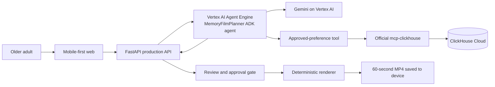

# Agent Engine Memory Film Planner Design

## Purpose

Memory Director helps an older adult turn consented phone photos and videos into a 60-second memory film. This design adds a production-grade agent path that satisfies the Google Cloud Agentic Cinema ClickHouse track: Gemini and Google Cloud Agent Builder make the creative plan, while the official `mcp-clickhouse` server supplies a small, auditable preference lookup at runtime.

The first release is deliberately one agent, not a multi-agent network. A single `MemoryFilmPlanner` must reliably create a reviewable plan for the three-minute product demonstration before the project expands into additional agents.

## Scope

### In scope

- An ADK agent deployed to Vertex AI Agent Engine and backed only by Gemini on Vertex AI.
- A consent-gated planning request containing the user request, selected media metadata, and optional prior creative preferences.
- A tool that queries ClickHouse through the official `mcp-clickhouse` server for approved music-direction preferences only.
- A schema-validated response containing a 60-second edit decision list, title, caption, music direction, and explanation of the selected media.
- An API adapter that calls the deployed agent and maps the result to the existing `ProductionProposal` review flow.
- Reproducible deployment and smoke-test evidence proving Gemini, Agent Engine, and `mcp-clickhouse` are invoked at runtime.

### Out of scope

- Access to an entire phone photo library. The browser MVP only receives media the user explicitly selects.
- Autonomous publishing to social media.
- Music generation, ingestion of commercial tracks, or storage of media files in ClickHouse.
- Agent-driven rendering without the existing explicit approval gate.
- A second agent, live voice conversation, face recognition, or a native mobile application.

## Product contract

The user chooses photos and/or videos, states a desired occasion or tone by typing or browser voice input, and grants media consent. The agent returns a proposal that fits exactly 60 seconds:

- a concise title and share caption;
- a suggested licensed-library music direction, never a copyrighted song title;
- a list of selected media IDs with trim start/end seconds and ordering;
- held-back media IDs with a short reason;
- an explanation suitable for the review screen.

The API must reject a plan if the duration is not 60 seconds, references an asset absent from the consented request, exposes a private URI, or contains a music track identifier outside the application library. The user may remove an item and request another plan. Only an explicit approval can reach the renderer.

## Architecture



### Runtime responsibilities

| Component | Responsibility | Must not do |
| --- | --- | --- |
| Browser | Obtain consent, upload/select media, display plan, request approval | Read the phone library without user selection; receive credentials |
| FastAPI | Validate request and agent response, invoke Agent Engine, persist only safe event metadata | Send private Cloud credentials to browser; bypass approval |
| MemoryFilmPlanner | Use Gemini to assemble a structured creative plan and invoke tools when appropriate | Render media; publish content; return unvalidated prose |
| Preference tool | Query prior accepted music directions through `mcp-clickhouse` | Query raw media, passwords, or arbitrary user-provided SQL |
| `mcp-clickhouse` | Execute the allow-listed read-only query against ClickHouse Cloud | Write or delete data during planning |
| Renderer | Produce the approved 60-second MP4 from approved selections | Choose new media or run before approval |

## Agent and tool interface

The API constructs an `AgentPlanningRequest` from consented media analysis data, not raw browser file paths. Its fields are:

```python
class AgentPlanningRequest(BaseModel):
    request_text: str
    media: list[AnalyzedMedia]
    user_id: str
    occasion: str
    requested_music_direction: str | None = None
```

`AnalyzedMedia` contains only `media_id`, MIME type, duration when available, quality signals, safe Gemini caption, and duplicate relationship. It excludes storage URI, original filename, EXIF coordinates, and facial identity claims.

The agent produces an `AgentProductionPlan` with this contract:

```python
class AgentProductionPlan(BaseModel):
    title: str
    caption: str
    music_direction: str
    selected_segments: list[SelectedSegment]
    held_back_media_ids: list[str]
    user_explanation: str
```

Every `SelectedSegment` has a known `media_id`, non-negative trim values, and duration. The adapter enforces a total duration of exactly 60 seconds before converting it into the existing production proposal. When the user supplied a music request, the agent treats it as a preference; it still returns a library direction rather than an unlicensed song.

The only initial ADK tool is `lookup_approved_music_preference(user_id, occasion)`. It calls `mcp-clickhouse` using a fixed parameterized query equivalent to:

```sql
SELECT value, count() AS evidence_count
FROM creative_preferences
WHERE user_id = :user_id
  AND occasion = :occasion
  AND decision = 'accepted'
GROUP BY value
ORDER BY evidence_count DESC, value ASC
LIMIT 1
```

The tool returns either one direction and evidence count or no result. It has no general SQL input and no write capability.

## Security, privacy, and safety

- Gemini is the sole product AI provider. No other model, agent framework, or AI API is called at runtime.
- The agent service uses workload identity and Secret Manager references; credentials never enter source control, browser JavaScript, logs, or ClickHouse events.
- Agent Engine receives only consented, privacy-filtered metadata or private GCS references under the API service identity. The generated response cannot include those URIs.
- User-selected photos and video remain in private storage. ClickHouse records anonymised production events and preference decisions, never raw media.
- The planning path remains read-only against ClickHouse. Writes stay in the existing application event path with explicit schema and audit timestamps.
- Export remains blocked until the user approves the presented plan.

## Deployment and configuration

Agent deployment belongs to the existing application domain, not Terraform bootstrap or the public-edge component. Terraform must enable and grant the minimum Vertex AI Agent Engine permissions required by the application identity. Runtime identifiers are non-secret configuration; ClickHouse credentials and any MCP authentication token stay in Secret Manager.

The deployed API gets a configured Agent Engine resource name. The planner's Cloud Run code must import and call `google-adk` and/or `google-cloud-aiplatform` Agent Engine APIs at runtime. The repository must also contain the `mcp-clickhouse` runtime configuration, not merely a documentation reference.

## Failure behavior

- If Agent Engine or Gemini is unavailable, the API returns a retryable planning error and does not fabricate a plan.
- If `mcp-clickhouse` is unavailable, planning may proceed without preference personalization only if the returned plan declares that no prior preference was used; the failure is recorded as a sanitized event.
- If structured agent output is invalid, over 60 seconds, or references unknown media, the API rejects it and does not enable approval.
- If no usable media remains after quality/duplicate checks, the API asks the user to choose additional material.

## Test and evidence requirements

Automated tests must cover:

1. A valid 60-second agent plan converts to an existing proposal.
2. Unknown media, non-60-second totals, private URI leakage, and invalid music choices are rejected.
3. The preference tool invokes the official MCP client/configuration with only the fixed read-only query inputs.
4. An MCP outage produces a safe non-personalized plan path and never exposes secrets.
5. The production adapter cannot call the renderer before explicit approval.

Deployment evidence must include:

1. a repeatable Agent Engine deployment command/workflow;
2. a smoke test showing an agent invocation and its structured 60-second response;
3. sanitized evidence of a successful `mcp-clickhouse` tool query at runtime;
4. a public web URL, repository URL, English-subtitled demo video, and the media-rights record required for submission.

## Rollout order

1. Add and test the typed planner contracts and validation adapter locally.
2. Add the official ClickHouse MCP tool configuration and its safe preference wrapper.
3. Define, deploy, and smoke-test the ADK agent on Agent Engine.
4. Integrate the API adapter behind explicit runtime configuration.
5. Record the end-to-end English-subtitled demonstration and verify the evidence checklist.

This order keeps the existing working proposal and renderer usable while Agent Engine configuration is completed.
